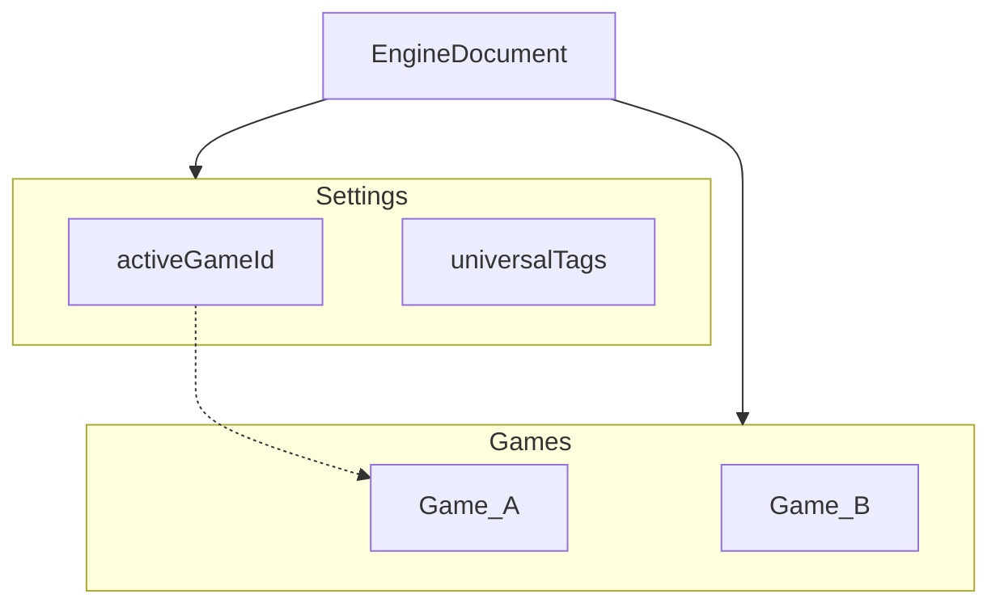

# Settings + Games (Universal tags)

**Living document.** Genre-neutral engine design for the save/runtime envelope and cross-game tags. Host theme (e.g. Astrevno “prestige expands possibility”) stays in the host.

**Status:** Implemented as protocol **`0.2.0.0`** (breaking). Wiki “Prestige Support” maps to **UniversalTags** under Settings—not a top-level Prestige object.

Related: [engine-composition.md](./engine-composition.md).

---

## Shape

The **only** serializable engine root is an **EngineDocument**:

```text
EngineDocument
  settings.activeGameId
  settings.universalTags   ← cross-game tag holdings (tags only in v1)
  games[gameId]            ← full playthrough EngineState (includes active)
```

Invariants: at least one game; `activeGameId ∈ games`; play commands mutate only the active game; universal holder id is reserved (`settings`) and never appears inside a game’s `entities`.



## UniversalTags and play

Tag reads / active resolution for the active game also consider `settings.universalTags`:

| Concern | Behavior |
|---------|----------|
| `tag` requirements | True if active on the scoped entity **or** an unslotted universal tag (or a universal slotted tag selected onto that entity) |
| Unslotted universal passives | Apply on the **active game’s primary** only |
| Slotted universal | Held in `universalTags`; selected per game via `slotSelections` with `holderEntityId: 'settings'` |
| `has-slot` | Local **or** universal ownership |
| `has-slot-local` | Entity holdings only |
| `has-slot-universal` | UniversalTags only |

Same slotted holding may be selected in **each** game once (`cannotShareTag` still applies within a single game).

## Commands

Document ops use **`settings-`** / **`games-`** prefixes: `settings-grant-tag`, `settings-add-tag`, `settings-remove-tag`, `games-create`, `games-switch`, `games-fork`, `games-delete`.

Play commands (`tick`, `execute-action`, `grant-tag`, `select-slot-item`, …) always target the active game.

## API

- `createEngineDocument` / `reduceEngineDocument` / `engineDocumentToJSON` / `engineDocumentFromJSON`
- `getActiveGame` / `migrateEngineStateToDocument` (0.1 → 0.2 one-shot)
- No bare-`EngineState` save root; per-game slice remains `EngineState` inside `games`

## Bootstrap from UniversalTags (host pattern)

Play-time merge already applies unslotted universal **gates and passives** without copying tags into the new run. When a meta unlock should also **mint local run state** (extra starting entity, local grant-tag, immediate slot selection), the host applies that while building the `EngineState` passed to `games-create`—no extra engine command is required.

```ts
// Content: universal tag → play commands to apply on the fresh game slice
const START_UNLOCKS: ReadonlyArray<{
  requiresUniversalTag: string;
  apply: readonly EngineCommand[];
}> = [
  {
    requiresUniversalTag: 'Unlock_ExtraCrate',
    apply: [
      { type: 'spawn-entity', definitionId: 'Emergency Supply Card' },
      {
        type: 'add-tag',
        entityId: 'player',
        tag: createTag({ name: 'Event_BonusStart', effects: [] }),
      },
    ],
  },
];

function buildNewGame(
  doc: EngineDocument,
  options: ReduceEngineOptions,
): EngineState {
  let game = createEngineState({ /* base loadout */ });
  for (const recipe of START_UNLOCKS) {
    if (!doc.settings.universalTags.has(recipe.requiresUniversalTag)) continue;
    for (const command of recipe.apply) {
      game = reduceEngineState(game, command, options);
    }
  }
  return game;
}

reduceEngineDocument(
  doc,
  {
    type: 'games-create',
    gameId: 'game-1',
    game: buildNewGame(doc, options),
    switchTo: true,
  },
  options,
);
```

Slotted universal holdings stay in `settings.universalTags`; after create (or inside `apply`), use `select-slot-item` with `holderEntityId: 'settings'` if the new run should start with that selection.

## Host notes

Astrevno (and others) store the document as the engine blob, bump host save format as needed, and treat player-facing “prestige” as copy over UniversalTags.

`primaryEntityId` stays on each `EngineState` game slice (sim pointer next to entities). `gameMeta` is host-facing lifecycle/presentation only—not a second home for primary.
